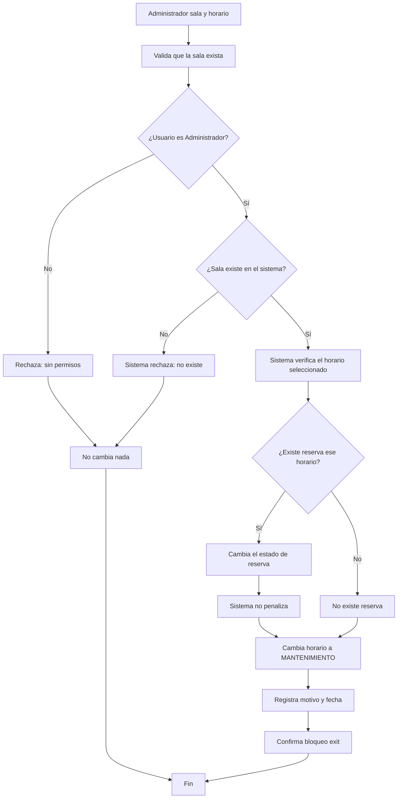

# Sesión 7 — Historias, casos de uso y modelos

- Proyecto: SalaMandra — Reserva de Salas de Estudio
- Integrantes: Luciana Soza (@luci-solar34), Sebastian Cruz (@Sebas0032), Sebastian Toledo (@sebas-sst)
- Fecha: 02 de octubre de 2026
- Requisitos de origen: [Sesión 6](sesion-06-requisitos.md)
- Flujo seleccionado: Bloqueo de horario de una sala por Mantenimiento y cancelación automática de reservas
- IDs seleccionados y estado de aprobación: RES-RF-03 (Confirmado)

---

## 1. Historia RES-HU-02

Como Adminitrador, quiero bloquear un horario específico de una sala cuando hay una falla o imprevisto, de modo que el sistema cancele automáticamente la reserva asociada a ese horario, sin penalizar al estudiante.

- Requisitos relacionados: RES-RF-03

---

## 2. Caso de uso RES-CU-02 — Bloquear un horario de una sala por mantenimiento

- **Objetivo:** permitir que un usuario Administrador bloquee el horario de una sala cuando hay un imprevisto, cancelando automáticamente las reservas que estaban confirmadas sin penalizar a los estudiantes.
- **Actor principal:** usuario con rol de Administrador.
- **Disparador:** el usuario Administrador detecta un problema en una sala ya sea por un fallo o por otra razón, y la bloquea.
- **Precondiciones:** 
  - La sala existe en el sistema.
  - El usuario tiene rol de Administrador (autorizado para bloquear reservas de las salas).
- **Poscondición de éxito:** el horario seleccionado de la sala pasa a estado MANTENIMIENTO; si existe alguna reserva confirmada asociada a ese horario, esta pasa a estado POR_MANTENIMIENTO, ningún estudiante recibe penalización y se registra el motivo del bloqueo.
- **Garantía ante rechazo:** el horario seleccionado mantiene su estado anterior, no se cancela ninguna reserva y se informa al usuario Administrador por qué el bloqueo no fue posible.

### Flujo principal

1. El usuario Administrador selecciona la sala y el horario que desea bloquear por mantenimiento.
2. El sistema valida que la sala exista y que el usuario tenga permisos de Administrador.
3. El sistema verifica que el horario seleccionado no esté ya en estado MANTENIMIENTO.
4. El sistema busca si existe una reserva confirmada asociada al horario seleccionado.
5. Para la reserva encontrada, el sistema cambia su estado a POR_MANTENIMIENTO sin registrar penalización.
6. El sistema cambia el estado del horario seleccionado a MANTENIMIENTO.
7. El sistema registra el motivo del bloqueo (ej: "No hay electricidad") y la fecha/hora.
8. El sistema confirma que el bloqueo fue exitoso y lista la reserva cancelada.
### E1 — Rechazo: usuario sin permisos de Administrador, paso 2

- **Ocurre en el paso:** 2 (validación de permisos).
- **Condición:** el usuario que solicita bloquear no tiene rol de Administrador.
- **Respuesta del sistema:** 
  - Rechaza la solicitud.
  - Informa: "No tienes permisos para bloquear salas. Contacta al administrador."
- **Estado final y datos que se conservan:** 
  - La sala sigue con su estado anterior (DISPONIBLE o EN_USO).
  - Ninguna reserva se modifica.
- **El caso termina sin hacer cambios.**

### E2 — Rechazo: sala no existe, paso 2

- **Ocurre en el paso:** 2 (validación de existencia).
- **Condición:** el ID o nombre de la sala no corresponde a ninguna sala en el sistema.
- **Respuesta del sistema:** 
  - Rechaza la solicitud.
  - Informa: "La sala [ID] no existe en el sistema."
- **Estado final y datos que se conservan:** 
  - No hay cambios en el sistema.
- **El caso termina sin hacer cambios.**

---

## 3. Modelo RES-MOD-02 — Bloqueo de horario de una sala y cancelación automática

- **Tipo elegido:** Diagrama de actividad simplificado
- **Pregunta que responde:** ¿Qué ocurre cuando se solicita bloquear un horario de una sala? ¿Quién puede hacerlo? ¿Qué cambia en la sala y sus reservas?
- **Alcance y aspectos que deja fuera:** 
  - Este modelo representa solo el flujo de autorización y bloqueo de un horario de una sala.
  - No modela notificaciones a estudiantes (futura funcionalidad).
  - No muestra detalles de cómo se comunica el mantenimiento con los estudiantes sobre sus reservas canceladas.
  - Si el horario seleccionado tiene una reserva confirmada, esta se cambia a `POR_MANTENIMIENTO` sin penalización.
  - Los demás horarios de la misma sala no se modifican.

---

## 4. Estados o efectos sobre los datos

**Entidades que se están modelando:** Sala_Horario y Reservas asociadas

| Entidad | Estado actual | Evento y condición | Estado siguiente | Efecto sobre los datos |
|---|---|---|---|---|
| Sala_Horario | DISPONIBLE | Bloqueo por Mantenimiento | MANTENIMIENTO | Se registra el motivo del bloqueo y la fecha. Si existe una reserva confirmada asociada a ese horario, se cancela automáticamente. |
| Reserva | CONFIRMADA | Pertenece a una sala que fue bloqueada | POR_MANTENIMIENTO | Se actualiza el estado. No se registra penalización al estudiante. Se conserva el motivo del bloqueo para referencia. |
| Reserva | CONFIRMADA | Intento de bloqueo SIN autorización | CONFIRMADA | No cambia nada. La sala permanece con su estado anterior. |

---

## 5. Trazabilidad

| Requisito de sesión 6 | Historia / caso de uso | Paso o rama del modelo | Escenario de aceptación relacionado |
|---|---|---|---|
| RES-RF-03 | RES-HU-02, RES-CU-02 | Rama principal (pasos 4–8) | **Normal:** Usuario Administrador bloquea el horario B de la sala B-102. El sistema cambia el horario a `MANTENIMIENTO` y la reserva asociada a `POR_MANTENIMIENTO`, sin penalización. Los demás horarios de la sala no se modifican. |
| RES-RF-03 | RES-CU-02 | E1 (paso 2, validación de permisos) | **Rechazo 1:** Usuario sin rol Administrador intenta bloquear. Sistema rechaza. Resultado: Horario y reservas sin cambios. |
| RES-RF-03 | RES-CU-02 | E2 (paso 2, validación de existencia) | **Rechazo 2:** Usuario intenta bloquear un horario de una sala que no existe. Sistema rechaza. Resultado: No hay cambios en el sistema. |

---

## 6. Dudas y cambios en los requisitos

| Requisito | Duda o cambio | Estado / confirmación del cliente | Impacto |
|---|---|---|---|
| RES-RF-03 | ¿Se debe enviar una notificación automática (email/SMS) a los estudiantes cuyas reservas fueron canceladas por mantenimiento? | Pendiente de aclaración con Sergio | Afecta la poscondición: ¿el caso termina solo con log interno, o incluye comunicación a estudiantes? |
| RES-RF-03 | ¿Cuánto tiempo tarda la liberación de una sala? ¿Debe un operador desbloquearla manualmente o se auto-libera después de X horas? | Pendiente de aclaración con Sergio | Afecta la futura funcionalidad de desbloqueo. Por ahora, el modelo asume bloqueo manual hasta que Mantenimiento lo resuelve. |

---

## 7. Siguiente paso y participación

- **Tarea de desarrollo derivada del modelo:** Implementar en Django el estado del modelo `SalaHorario` para representar `DISPONIBLE` y `MANTENIMIENTO`, mantener el estado de `Reservation` para `POR_MANTENIMIENTO`, y crear la función `block_sala_horario_for_maintenance()` en `services.py` que bloquee el horario seleccionado y, si existe una reserva confirmada asociada, la cambie a `POR_MANTENIMIENTO` sin aplicar penalización.
- **Requisito que la justifica:** RES-RF-03
- **Responsable inicial:** Sebastian Cruz (@Sebas0032)
- **Issue existente o nuevo, si corresponde:** Issue #17 — Implementar Bloqueo de horario de una sala por Mantenimiento (Django ORM)
- **Aportes de cada integrante:**
  - **Luciana Soza:** Redacción de la historia RES-HU-02 y formulación de preguntas sobre notificaciones a estudiantes.
  - **Sebastian Cruz:** Desarrollo del caso de uso textual (flujo principal, E1 y E2) con validaciones de autorización claras.
  - **Sebastian Soto:** Diseño del diagrama de actividad con decisión de permisos, tabla de estados de sala y reservas, y trazabilidad.
- **Asistencia de IA, si se utilizó:** 
  - **Herramienta:** Claude (asistente IA)
  - **Propósito:** Actualización del archivo sesion-07-modelos.md para cambiar de RES-RF-02 (cancelación) a RES-RF-03 (bloqueo).
  - **Aporte:** Adaptación de historia, caso de uso, diagrama mermaid y tabla de estados; incorporación de E1 y E2 para rechazos por permisos y sala inexistente.
  - **Verificación:** El equipo confirmó que el modelo cubre RES-RF-03 del sesion06.md, que incluye dos rutas de rechazo claras y que la poscondición especifica "sin penalización" (diferencia crítica con cancelación manual).

---

